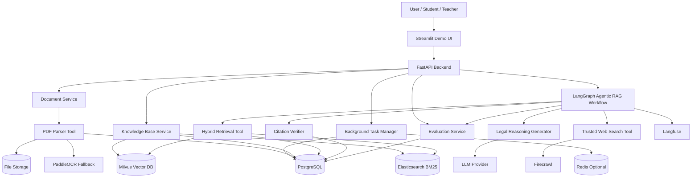

# 02 - Detailed Design：Agentic RAG 国际公法研究助手

> 项目名称：**Agentic RAG 国际公法研究助手**
> 英文代号：**PublicLaw Research Agent**
> 输入文档：`01-proposal.md`
> 输出文档：`02-detailed_design.md`
> 文档类型：详细设计文档 / Detailed Design
> 版本定位：基于现有原型升级到最终版系统
> 前端形态：FastAPI 后端 + Streamlit 演示前端
> 默认回答语言：English
> 默认回答格式：IRAC + Sources

---


## 1. 设计目标

本详细设计文档根据 `01-proposal.md` 生成，目标是将需求文档中的功能、技术栈和原型升级路径转化为可实现、可测试、可分工开发的工程设计。

系统最终目标是：

```text
基于国际公法案例 PDF、权威资料、混合检索、引用校验和评测日志，
构建一个可追溯、可验证、可评估的英文 Agentic RAG 法律研究助手。
```

本系统不是普通聊天机器人，而是一个以法律证据为中心的 RAG 工作流系统。所有关键法律结论应尽量来自本地 Evidence Pack 或可信联网证据，并通过 Citation Verifier 进行校验。

---

## 2. 总体设计原则

### 2.1 模块独立

各模块之间通过 Pydantic Schema、Repository、Service、Tool Interface 和 API Contract 解耦。每个模块应能独立进行单元测试。

### 2.2 前后端分离

Streamlit 仅作为演示前端，不直接执行 PDF 解析、模型调用、检索、索引构建和数据库写入。核心逻辑全部放在 FastAPI 后端。

### 2.3 检索与生成解耦

检索模块只负责生成 Evidence Pack；生成模块只基于 Evidence Pack 输出答案；Citation Verifier 负责检查答案是否被证据支持。

### 2.4 业务数据与索引数据分离

- PostgreSQL：业务主库，保存文档、chunk、引用锚点、问答日志、检索日志、任务状态和评测结果。
- Milvus：只负责 dense vector 索引。
- Elasticsearch：只负责 BM25 全文检索索引。
- 文件系统 / 对象存储：保存原始 PDF、OCR 输出和导出文件。

### 2.5 可观测与可评估

每次问答都必须生成 `trace_id`，并记录检索、重排、生成、引用校验、fallback 和评测结果。关键节点应写入 PostgreSQL 日志，并同步接入 Langfuse trace。

### 2.6 长任务异步化

PDF 解析、OCR、embedding、Milvus 索引、Elasticsearch 索引、批量评测都应作为异步任务执行，避免阻塞 HTTP 请求。

### 2.7 失败可恢复

所有可重试任务都应保存任务状态、错误信息、重试次数和中间状态，使系统支持重试、重建索引和故障恢复。

---

## 3. 最终技术栈

| 层级 | 技术选型 | 职责 |
|---|---|---|
| 后端服务 | FastAPI | 提供文档、问答、检索、引用、评测、任务 API |
| 前端展示 | Streamlit | 演示前端、上传、问答、日志展示 |
| 工作流编排 | LangGraph | 编排 Agentic RAG 节点和条件路由 |
| 数据校验 | Pydantic v2 | API、工具、状态、评测输出 schema |
| PDF 主解析 | PyMuPDF | 文本、页码、block、line、span、结构抽取 |
| PDF 辅助处理 | pypdf | 元数据、页数、拆分、合并等辅助操作 |
| 复杂文档兜底 | Unstructured | PyMuPDF 失败时兜底解析 |
| OCR | PaddleOCR | 扫描页与乱码页 OCR 兜底 |
| Embedding | BAAI/bge-m3 | 多语言、跨语言、长文本 dense embedding |
| 向量数据库 | Milvus Lite / Milvus Standalone | chunk embedding 语义召回 |
| 关键词检索 | Elasticsearch BM25 | 案例名、术语、条文、段落号精确匹配 |
| Reranker | BAAI/bge-reranker-v2-m3 | 对候选 evidence 重排 |
| 业务数据库 | PostgreSQL | 元数据、问答、任务、日志、评测结果 |
| ORM / Migration | SQLAlchemy 2.0 + Alembic | 数据模型和数据库迁移 |
| 缓存 / 任务队列 | Redis + RQ / Celery，可升级 | 异步任务队列、任务状态缓存 |
| MVP 异步方案 | FastAPI BackgroundTasks + PostgreSQL task 表 | 简化实现，不强依赖任务队列 |
| LLM 接入 | OpenAI-compatible API / Qwen API / DeepSeek API | 统一 provider 层调用 |
| 联网补充 | Firecrawl + Trusted Source Whitelist | 证据不足时查询可信来源 |
| 评测 | RAGAS + Custom Citation Metrics | 通用 RAG 指标与法律 citation 指标 |
| 可观测性 | Langfuse | Trace、prompt、latency、token usage |
| 部署 | Docker Compose | 管理多服务部署 |
| 配置管理 | YAML + `.env` | 模型、检索、prompt、数据库、可信来源配置 |

---

## 4. 系统总体架构



---

## 5. 推荐工程目录结构

```text
publiclaw-research-agent/
├── app/
│   ├── main.py                         # FastAPI 入口
│   ├── api/                            # API router
│   │   ├── documents.py
│   │   ├── tasks.py
│   │   ├── qa.py
│   │   ├── retrieval.py
│   │   ├── citations.py
│   │   ├── evaluation.py
│   │   ├── feedback.py
│   │   └── logs.py
│   ├── core/                           # 全局配置、日志、异常、依赖注入
│   │   ├── config.py
│   │   ├── logging.py
│   │   ├── exceptions.py
│   │   ├── response.py
│   │   ├── security.py
│   │   └── dependencies.py
│   ├── schemas/                        # Pydantic schema
│   │   ├── common.py
│   │   ├── documents.py
│   │   ├── chunks.py
│   │   ├── tasks.py
│   │   ├── retrieval.py
│   │   ├── qa.py
│   │   ├── citations.py
│   │   ├── evaluation.py
│   │   ├── feedback.py
│   │   └── workflow.py
│   ├── db/                             # SQLAlchemy model 与 session
│   │   ├── base.py
│   │   ├── session.py
│   │   └── models.py
│   ├── repositories/                   # 数据访问层
│   │   ├── documents.py
│   │   ├── chunks.py
│   │   ├── tasks.py
│   │   ├── qa.py
│   │   ├── citations.py
│   │   ├── retrieval_logs.py
│   │   ├── evaluation_logs.py
│   │   └── feedback.py
│   ├── services/                       # 业务服务层
│   │   ├── document_service.py
│   │   ├── parsing_service.py
│   │   ├── task_service.py
│   │   ├── indexing_service.py
│   │   ├── retrieval_service.py
│   │   ├── qa_service.py
│   │   ├── citation_service.py
│   │   ├── evaluation_service.py
│   │   ├── normalization_service.py
│   │   └── logging_service.py
│   ├── tools/                          # MCP-style 工具层
│   │   ├── pdf_parser_tool.py
│   │   ├── local_kb_tool.py
│   │   ├── hybrid_retrieval_tool.py
│   │   ├── trusted_web_search_tool.py
│   │   ├── citation_verification_tool.py
│   │   ├── evaluation_tool.py
│   │   └── logging_tool.py
│   ├── workflows/                      # LangGraph 工作流
│   │   ├── state.py
│   │   ├── nodes.py
│   │   ├── graph.py
│   │   ├── routers.py
│   │   └── checkpoint.py
│   ├── llm/                            # LLM provider 层
│   │   ├── base.py
│   │   ├── openai_compatible.py
│   │   ├── prompt_registry.py
│   │   └── prompts.py
│   ├── retrieval/                      # 检索、融合、重排实现
│   │   ├── bm25.py
│   │   ├── vector.py
│   │   ├── fusion.py
│   │   ├── reranker.py
│   │   └── normalization.py
│   ├── indexing/                       # ES / Milvus 索引构建
│   │   ├── elasticsearch_indexer.py
│   │   ├── milvus_indexer.py
│   │   ├── index_consistency.py
│   │   └── embedding.py
│   └── utils/
│       ├── ids.py
│       ├── text_cleaning.py
│       ├── hashing.py
│       ├── file_validation.py
│       └── time.py
├── frontend/
│   └── streamlit_app.py
├── config/
│   ├── sources.yaml
│   ├── models.yaml
│   ├── retrieval.yaml
│   ├── prompts.yaml
│   ├── evaluation.yaml
│   ├── database.yaml
│   ├── security.yaml
│   └── app.yaml
├── data/
│   ├── eval_sets/
│   ├── aliases/
│   └── legal_terms/
├── storage/
│   ├── raw_pdfs/
│   ├── parsed_pages/
│   ├── ocr_outputs/
│   └── exports/
├── migrations/                         # Alembic migrations
├── scripts/
│   ├── init_db.py
│   ├── init_milvus.py
│   ├── init_elasticsearch.py
│   ├── backfill_aliases.py
│   └── run_eval.py
├── tests/
│   ├── unit/
│   ├── integration/
│   └── e2e/
├── docker-compose.yml
├── Makefile
├── pyproject.toml
├── .env.example
└── README.md
```

---

## 6. 核心数据模型设计

### 6.1 通用响应 Schema

```python
class ErrorBody(BaseModel):
    code: str
    message: str
    details: dict[str, Any] = Field(default_factory=dict)

class ApiResponse(BaseModel):
    success: bool
    data: Any | None = None
    error: ErrorBody | None = None
    trace_id: str | None = None

class PageParams(BaseModel):
    page: int = Field(default=1, ge=1)
    page_size: int = Field(default=20, ge=1, le=100)

class PageResult(BaseModel):
    items: list[Any]
    page: int
    page_size: int
    total: int
```

### 6.2 DocumentCreate

```python
class DocumentCreate(BaseModel):
    title: str
    institution: str | None = None
    year: int | None = None
    legal_domain: str | None = None
    document_type: Literal[
        "case_report", "treaty", "teaching_material", "article", "other"
    ] = "case_report"
    language: str = "en"
    source_url: str | None = None
    tags: list[str] = Field(default_factory=list)
```

### 6.3 DocumentPage

```python
class DocumentPageSchema(BaseModel):
    page_id: str
    doc_id: str
    pdf_page_number: int
    printed_page_number: str | None = None
    citation_page_number: str | None = None
    text: str
    cleaned_text: str | None = None
    source_type: Literal["pdf_text", "ocr", "unstructured"]
    parse_status: Literal["success", "partial_success", "failed"]
    header_footer_removed: bool = False
    error_message: str | None = None
```

### 6.4 DocumentChunk

```python
class DocumentChunkSchema(BaseModel):
    chunk_id: str
    doc_id: str
    page_id: str | None = None
    title: str
    pdf_page_number: int | None = None
    printed_page_number: str | None = None
    citation_page_number: str | None = None
    paragraph_number: str | None = None
    paragraph_number_confidence: float | None = None
    section_title: str | None = None
    text: str
    original_sentence: str | None = None
    footnote_text: str | None = None
    citation_anchor: str
    source_type: Literal["pdf_text", "ocr", "unstructured"]
    token_count: int | None = None
    embedding_id: str | None = None
    bm25_id: str | None = None
```

### 6.5 EvidenceChunk

```python
class EvidenceChunk(BaseModel):
    chunk_id: str
    doc_id: str | None = None
    title: str
    institution: str | None = None
    year: int | None = None
    legal_domain: str | None = None
    document_type: str | None = None
    pdf_page_number: int | None = None
    printed_page_number: str | None = None
    citation_page_number: str | None = None
    paragraph_number: str | None = None
    section_title: str | None = None
    text: str
    original_sentence: str | None = None
    snippet: str | None = None
    citation_anchor: str
    bm25_score: float | None = None
    vector_score: float | None = None
    fused_score: float | None = None
    rerank_score: float | None = None
    source_url: str | None = None
    source_channel: Literal["local_pdf", "trusted_web"] = "local_pdf"
    trust_level: Literal["official", "academic", "user_configured", "unknown"] | None = None
```

### 6.6 Citation

```python
class Citation(BaseModel):
    citation_id: str
    chunk_id: str | None = None
    doc_id: str | None = None
    title: str
    citation_page_number: str | None = None
    pdf_page_number: int | None = None
    paragraph_number: str | None = None
    original_sentence: str | None = None
    snippet: str | None = None
    citation_anchor: str
    source_url: str | None = None
    source_channel: Literal["local_pdf", "trusted_web"]
    trust_level: Literal["official", "academic", "user_configured", "unknown"] | None = None
```

### 6.7 Task Schema

```python
class BackgroundTaskCreate(BaseModel):
    task_type: Literal[
        "parse_document",
        "index_document",
        "reindex_document",
        "run_evaluation",
        "delete_document_indexes",
    ]
    target_id: str
    payload: dict[str, Any] = Field(default_factory=dict)

class BackgroundTaskRead(BaseModel):
    task_id: str
    task_type: str
    target_id: str
    status: Literal["pending", "running", "success", "failed", "cancelled"]
    progress: float = 0.0
    retry_count: int = 0
    error_message: str | None = None
    created_at: datetime
    started_at: datetime | None = None
    finished_at: datetime | None = None
```

---

## 7. 数据库详细设计

### 7.1 表清单

| 表名 | 作用 |
|---|---|
| documents | 保存文档级元数据 |
| document_pages | 保存页级文本 |
| document_chunks | 保存检索 chunk |
| citation_anchors | 保存引用锚点 |
| background_tasks | 保存异步任务状态 |
| case_aliases | 保存案件别名和标准案名映射 |
| trusted_web_sources | 保存可信联网来源配置 |
| web_evidence | 保存联网 fallback 返回的 evidence |
| prompt_versions | 保存 prompt 版本和 hash |
| qa_sessions | 保存问答会话 |
| qa_messages | 保存用户问题和系统回答 |
| retrieval_results | 保存每次检索结果 |
| answer_citations | 保存答案实际引用 |
| model_runs | 保存模型调用记录 |
| trace_logs | 保存完整调用链摘要 |
| evaluation_logs | 保存评测结果 |
| feedback_logs | 保存用户反馈 |
| error_logs | 保存错误日志 |

### 7.2 documents

| 字段 | 类型 | 说明 |
|---|---|---|
| doc_id | UUID / VARCHAR | 主键 |
| title | TEXT | 文档标题 |
| institution | TEXT | 机构，例如 ICJ、WTO、ICSID |
| year | INTEGER | 年份 |
| legal_domain | TEXT | 法律领域 |
| document_type | TEXT | case_report / treaty / article 等 |
| language | TEXT | en / zh 等 |
| source_url | TEXT | 来源 URL |
| file_path | TEXT | 本地文件路径 |
| file_hash | TEXT | 文件 hash，用于去重 |
| upload_time | TIMESTAMP | 上传时间 |
| parse_status | TEXT | not_started / pending / running / success / partial_success / failed |
| index_status | TEXT | not_indexed / indexing / indexed / partial_indexed / failed |
| created_at | TIMESTAMP | 创建时间 |
| updated_at | TIMESTAMP | 更新时间 |

索引建议：

```sql
CREATE INDEX idx_documents_title ON documents(title);
CREATE INDEX idx_documents_institution ON documents(institution);
CREATE INDEX idx_documents_domain ON documents(legal_domain);
CREATE INDEX idx_documents_year ON documents(year);
CREATE UNIQUE INDEX idx_documents_file_hash ON documents(file_hash);
```

### 7.3 document_pages

| 字段 | 类型 | 说明 |
|---|---|---|
| page_id | UUID / VARCHAR | 主键 |
| doc_id | UUID / VARCHAR | 外键 |
| pdf_page_number | INTEGER | PDF 物理页码，从 1 开始 |
| printed_page_number | TEXT | 页面印刷页码，可为空 |
| citation_page_number | TEXT | 最终 citation 使用页码 |
| text | TEXT | 原始页文本 |
| cleaned_text | TEXT | 清洗后文本 |
| source_type | TEXT | pdf_text / ocr / unstructured |
| parse_status | TEXT | 解析状态 |
| header_footer_removed | BOOLEAN | 是否执行页眉页脚清洗 |
| error_message | TEXT | 错误信息 |
| created_at | TIMESTAMP | 创建时间 |

约束：`(doc_id, pdf_page_number)` 唯一。

### 7.4 document_chunks

| 字段 | 类型 | 说明 |
|---|---|---|
| chunk_id | UUID / VARCHAR | 主键 |
| doc_id | UUID / VARCHAR | 外键 |
| page_id | UUID / VARCHAR | 外键 |
| title | TEXT | 冗余标题，便于返回 |
| pdf_page_number | INTEGER | PDF 物理页码 |
| printed_page_number | TEXT | 印刷页码 |
| citation_page_number | TEXT | citation 页码 |
| paragraph_number | TEXT | 段落号 |
| paragraph_number_confidence | FLOAT | 段落号识别置信度 |
| section_title | TEXT | 章节标题 |
| text | TEXT | chunk 正文 |
| original_sentence | TEXT | 代表性原句 |
| footnote_text | TEXT | 脚注文本，可为空 |
| citation_anchor | TEXT | 引用锚点 |
| source_type | TEXT | pdf_text / ocr / unstructured |
| token_count | INTEGER | 估计 token 数 |
| embedding_id | TEXT | Milvus 主键或外部 id |
| bm25_id | TEXT | Elasticsearch id |
| created_at | TIMESTAMP | 创建时间 |

索引建议：

```sql
CREATE INDEX idx_chunks_doc_id ON document_chunks(doc_id);
CREATE INDEX idx_chunks_page ON document_chunks(doc_id, citation_page_number);
CREATE INDEX idx_chunks_para ON document_chunks(paragraph_number);
CREATE UNIQUE INDEX idx_chunks_anchor ON document_chunks(citation_anchor);
```

### 7.5 citation_anchors

| 字段 | 类型 | 说明 |
|---|---|---|
| citation_id | UUID / VARCHAR | 主键 |
| citation_anchor | TEXT | 唯一锚点 |
| chunk_id | UUID / VARCHAR | 关联 chunk |
| doc_id | UUID / VARCHAR | 关联文档 |
| title | TEXT | 文档标题 |
| citation_page_number | TEXT | citation 页码 |
| pdf_page_number | INTEGER | PDF 页码 |
| paragraph_number | TEXT | 段落号 |
| original_sentence | TEXT | 原句 |
| formatted_citation | TEXT | 格式化引用 |
| created_at | TIMESTAMP | 创建时间 |

### 7.6 background_tasks

| 字段 | 类型 | 说明 |
|---|---|---|
| task_id | UUID / VARCHAR | 主键 |
| task_type | TEXT | parse_document / index_document / run_evaluation 等 |
| target_id | UUID / VARCHAR | doc_id / evaluation_run_id 等 |
| status | TEXT | pending / running / success / failed / cancelled |
| progress | FLOAT | 0-1 进度 |
| retry_count | INTEGER | 重试次数 |
| max_retries | INTEGER | 最大重试次数 |
| payload | JSONB | 任务输入参数 |
| result | JSONB | 任务输出摘要 |
| error_message | TEXT | 错误信息 |
| created_at | TIMESTAMP | 创建时间 |
| started_at | TIMESTAMP | 开始时间 |
| finished_at | TIMESTAMP | 结束时间 |

### 7.7 case_aliases

| 字段 | 类型 | 说明 |
|---|---|---|
| alias_id | UUID / VARCHAR | 主键 |
| doc_id | UUID / VARCHAR | 对应文档，可为空 |
| normalized_case_name | TEXT | 标准案名 |
| alias | TEXT | 别名 |
| institution | TEXT | 机构 |
| year | INTEGER | 年份 |
| created_at | TIMESTAMP | 创建时间 |

示例：

```text
Military and Paramilitary Activities in and against Nicaragua
Nicaragua case
Nicaragua v. United States
ICJ Nicaragua 1986
```

### 7.8 trusted_web_sources

| 字段 | 类型 | 说明 |
|---|---|---|
| source_id | UUID / VARCHAR | 主键 |
| name | TEXT | 来源名称 |
| domain | TEXT | 域名 |
| trust_level | TEXT | official / academic / user_configured / unknown |
| priority | INTEGER | 优先级 |
| enabled | BOOLEAN | 是否启用 |
| created_at | TIMESTAMP | 创建时间 |

### 7.9 web_evidence

| 字段 | 类型 | 说明 |
|---|---|---|
| web_evidence_id | UUID / VARCHAR | 主键 |
| trace_id | TEXT | trace id |
| url | TEXT | 来源 URL |
| title | TEXT | 网页标题 |
| domain | TEXT | 域名 |
| trust_level | TEXT | 可信等级 |
| snippet | TEXT | 搜索摘要 |
| extracted_text | TEXT | 抽取正文 |
| citation_anchor | TEXT | web citation anchor |
| created_at | TIMESTAMP | 创建时间 |

### 7.10 prompt_versions

| 字段 | 类型 | 说明 |
|---|---|---|
| prompt_id | UUID / VARCHAR | 主键 |
| prompt_name | TEXT | prompt 名称 |
| version | TEXT | 版本号 |
| template | TEXT | prompt 模板 |
| hash | TEXT | 模板 hash |
| is_active | BOOLEAN | 是否启用 |
| created_at | TIMESTAMP | 创建时间 |

### 7.11 qa_sessions / qa_messages

`qa_sessions` 保存会话；`qa_messages` 保存每轮问答。

`qa_messages` 建议字段：

| 字段 | 类型 | 说明 |
|---|---|---|
| message_id | UUID / VARCHAR | 主键 |
| session_id | UUID / VARCHAR | 会话 id |
| trace_id | TEXT | trace id |
| user_query | TEXT | 用户问题 |
| query_type | TEXT | 问题类型 |
| final_answer | TEXT | 最终答案 |
| answer_language | TEXT | 默认 en |
| fallback_triggered | BOOLEAN | 是否触发联网 |
| answerability | TEXT | answerable / partial / unanswerable |
| latency_ms | INTEGER | 响应耗时 |
| token_usage | JSONB | token 统计 |
| created_at | TIMESTAMP | 创建时间 |

### 7.12 retrieval_results

保存每次检索结果，支持追踪 BM25、vector、fusion、rerank 的每一步。

| 字段 | 类型 | 说明 |
|---|---|---|
| retrieval_id | UUID / VARCHAR | 主键 |
| trace_id | TEXT | trace id |
| message_id | UUID / VARCHAR | 问答消息 id |
| retrieval_stage | TEXT | bm25 / vector / fused / reranked |
| query_text | TEXT | 检索 query |
| chunk_id | UUID / VARCHAR | 命中 chunk |
| rank | INTEGER | 排名 |
| score | FLOAT | 分数 |
| metadata | JSONB | 额外信息 |
| created_at | TIMESTAMP | 创建时间 |

### 7.13 answer_citations

保存答案实际引用与 claim 的对应关系。

| 字段 | 类型 | 说明 |
|---|---|---|
| answer_citation_id | UUID / VARCHAR | 主键 |
| message_id | UUID / VARCHAR | 问答消息 id |
| citation_id | UUID / VARCHAR | 引用 id |
| chunk_id | UUID / VARCHAR | chunk id |
| claim_text | TEXT | 被支持的 claim |
| verification_status | TEXT | passed / partial / failed |
| support_score | FLOAT | claim 支持分数 |
| created_at | TIMESTAMP | 创建时间 |

### 7.14 evaluation_logs

保存 RAGAS 与自定义指标。

| 字段 | 类型 | 说明 |
|---|---|---|
| evaluation_id | UUID / VARCHAR | 主键 |
| trace_id | TEXT | trace id |
| message_id | UUID / VARCHAR | 问答消息 id |
| dataset_id | TEXT | 评测集 id，可为空 |
| faithfulness | FLOAT | RAGAS 指标 |
| answer_relevance | FLOAT | RAGAS 指标 |
| context_precision | FLOAT | RAGAS 指标 |
| context_recall | FLOAT | RAGAS 指标 |
| citation_accuracy | FLOAT | 自定义指标 |
| paragraph_match_rate | FLOAT | 自定义指标 |
| source_grounding_rate | FLOAT | 自定义指标 |
| unsupported_claim_rate | FLOAT | 自定义指标 |
| fallback_trigger_accuracy | FLOAT | 自定义指标，可为空 |
| retrieval_hit_rate | FLOAT | 自定义指标，可为空 |
| latency_ms | INTEGER | 响应耗时 |
| token_usage | JSONB | token 信息 |
| created_at | TIMESTAMP | 创建时间 |

### 7.15 feedback_logs

| 字段 | 类型 | 说明 |
|---|---|---|
| feedback_id | UUID / VARCHAR | 主键 |
| message_id | UUID / VARCHAR | 对应回答 |
| rating | INTEGER | 1-5 分 |
| feedback_type | TEXT | helpful / citation_wrong / too_general / hallucination / other |
| comment | TEXT | 用户评论 |
| created_at | TIMESTAMP | 创建时间 |

---

## 8. 配置管理详细设计

### 8.1 sources.yaml

```yaml
trusted_sources:
  - name: International Court of Justice
    domains:
      - icj-cij.org
    trust_level: official
    priority: 1
  - name: World Trade Organization
    domains:
      - wto.org
    trust_level: official
    priority: 1
  - name: ICSID
    domains:
      - icsid.worldbank.org
    trust_level: official
    priority: 1
  - name: United Nations
    domains:
      - un.org
      - treaties.un.org
    trust_level: official
    priority: 1
```

### 8.2 models.yaml

```yaml
llm:
  provider: openai_compatible
  model: qwen-plus
  temperature: 0.1
  max_tokens: 4096

embedding:
  model_name: BAAI/bge-m3
  dimension: 1024
  normalize: true

reranker:
  model_name: BAAI/bge-reranker-v2-m3
  top_n: 8
```

### 8.3 retrieval.yaml

```yaml
bm25:
  top_k: 30
  index_name: publiclaw_chunks

vector:
  top_k: 30
  collection_name: legal_chunks
  metric_type: COSINE

fusion:
  method: rrf
  rrf_k: 60
  final_top_k: 30

rerank:
  top_k: 30
  final_top_n: 8

answerability:
  min_evidence_count: 3
  min_rerank_score: 0.3
  enable_web_fallback: true
```

### 8.4 prompts.yaml

```yaml
irac_answer:
  version: v1
  system: |
    You are an international public law research assistant.
    Answer only with support from the provided evidence.
    Use English and the IRAC structure.
  template: |
    User question: {question}
    Evidence Pack:
    {evidence_pack}
    Generate an IRAC answer with Sources.

case_brief:
  version: v1
  template: |
    Generate a structured case brief based only on the evidence.

concept_explanation:
  version: v1
  template: |
    Explain the legal concept using the retrieved legal sources.
```

### 8.5 evaluation.yaml

```yaml
ragas:
  enabled: true
  metrics:
    - faithfulness
    - answer_relevance
    - context_precision
    - context_recall

custom_metrics:
  citation_accuracy:
    accept_threshold: 0.9
  paragraph_match_rate:
    accept_threshold: 0.8
  source_grounding_rate:
    accept_threshold: 0.8
  unsupported_claim_rate:
    max_threshold: 0.1
  fallback_trigger_accuracy:
    enabled: true
```

### 8.6 security.yaml

```yaml
upload:
  max_file_size_mb: 100
  allowed_extensions: [".pdf"]
  validate_magic_bytes: true

api:
  cors_allowed_origins:
    - http://localhost:8501
  rate_limit_per_minute: 30

logging:
  mask_api_keys: true
  max_prompt_preview_chars: 2000
  max_output_preview_chars: 2000
```

---

## 9. 模块详细设计

## 9.1 Document Upload Module

### 职责

负责接收用户上传 PDF，校验文件合法性，保存原始文件，创建文档元数据记录。

### 输入

- PDF 文件
- `DocumentCreate` 元数据

### 输出

- `DocumentRead`
- `doc_id`
- 文件保存路径
- 初始 `parse_status = not_started`
- 初始 `index_status = not_indexed`

### 主要流程

```text
POST /documents/upload
→ 校验扩展名、MIME type、PDF magic bytes
→ 计算 file_hash
→ 检查 documents.file_hash 是否重复
→ 使用 doc_id 作为存储文件名，避免路径穿越
→ 保存到 storage/raw_pdfs/{doc_id}.pdf
→ 写入 documents 表
→ 返回 doc_id
```

### 关键类

```python
class DocumentService:
    def upload_document(file: UploadFile, metadata: DocumentCreate) -> DocumentRead: ...
    def get_document(doc_id: str) -> DocumentRead: ...
    def list_documents(filters: DocumentFilter, page: PageParams) -> PageResult: ...
    def delete_document(doc_id: str) -> None: ...
```

### 异常处理

| 异常 | 处理 |
|---|---|
| 非 PDF 文件 | 返回 400 |
| 文件过大 | 返回 413 |
| PDF magic bytes 不匹配 | 返回 400 |
| 重复文件 | 返回已存在 doc_id 或 409 |
| 保存失败 | 写入 error_logs，返回 500 |

### 独立测试

1. 上传合法 PDF，检查文件保存和 documents 记录。
2. 上传非 PDF，返回 400。
3. 上传重复 PDF，触发去重逻辑。
4. 元数据缺失时触发 Pydantic 校验。
5. 文件名包含路径穿越字符时仍保存为安全 doc_id 文件名。

---

## 9.2 PDF Parsing Module

### 职责

将 PDF 转换为页级文本、段落级 chunk 和 citation anchor。该模块只负责解析，不负责检索和生成。

### 输入

- `doc_id`
- PDF `file_path`
- 文档元数据

### 输出

- `document_pages`
- `document_chunks`
- `citation_anchors`
- parse status

### 解析策略

```text
优先 PyMuPDF
→ 若页面文本为空、乱码或字符数低于阈值，调用 PaddleOCR
→ 若 PyMuPDF 整体失败，尝试 Unstructured
→ pypdf 仅做元数据、页数、拆分等辅助操作
```

### 页面解析流程

```text
for page in pdf:
    extract blocks/lines/spans by PyMuPDF
    detect printed page number
    clean header/footer
    fix line breaks and hyphenation
    detect footnotes
    detect if OCR needed
    if OCR needed:
        render page image
        run PaddleOCR
        mark source_type = ocr
    save DocumentPage
```

### 页码设计

系统区分三种页码：

| 字段 | 说明 |
|---|---|
| pdf_page_number | PDF 物理页码，从 1 开始 |
| printed_page_number | 页面中印刷显示的页码，可为空 |
| citation_page_number | 最终 citation 使用页码，优先使用 printed_page_number，否则使用 pdf_page_number |

### 文本清洗策略

1. 删除重复页眉、页脚、页码。
2. 修复断词，例如 `inter-\nnational` → `international`。
3. 修复段内换行。
4. 保留段落边界。
5. 对脚注单独标记，必要时附着到相邻正文 chunk。
6. 多栏文本按 PyMuPDF block 坐标排序，避免列顺序混乱。

### 段落号识别规则

支持以下模式：

```text
para. 12
paragraph 12
[12]
12.
Article 31
Art. 31
DSU Article 6.2
VCLT Article 31
```

正则示例：

```python
PARAGRAPH_PATTERNS = [
    r"\bpara\.\s*(\d+[A-Za-z]?)\b",
    r"\bparagraph\s*(\d+[A-Za-z]?)\b",
    r"^\[(\d+[A-Za-z]?)\]",
    r"^Article\s+(\d+[A-Za-z]?)",
    r"^Art\.\s+(\d+[A-Za-z]?)",
]
```

段落号识别结果应保存 `paragraph_number_confidence`。不是所有 `[12]` 都一定是真段落号，因此低置信度结果不应强行作为 citation 段落号。

### Chunk 切分策略

优先级：

1. 按段落号切分。
2. 按章节标题切分。
3. 按法律语义边界切分。
4. 若段落过长，则按 token window 切分，保留 overlap。
5. 不应跨越不同页码过长拼接，避免 citation 混乱。

建议参数：

```yaml
chunking:
  target_tokens: 450
  max_tokens: 700
  overlap_tokens: 80
  prefer_paragraph_boundary: true
```

### Citation Anchor 生成

有段落号时：

```text
{normalized_title}#p{citation_page_number}#para{paragraph_number}#chunk{short_chunk_id}
```

无段落号时：

```text
{normalized_title}#p{citation_page_number}#chunk{short_chunk_id}
```

### 关键类

```python
class PDFParserTool:
    def parse(doc_id: str, file_path: str) -> PDFParseResult: ...

class PageCleaner:
    def clean(page_text: str, page_blocks: list[dict]) -> CleanedPage: ...

class ChunkBuilder:
    def build_chunks(pages: list[DocumentPageSchema]) -> list[DocumentChunkSchema]: ...

class CitationAnchorBuilder:
    def build(chunk: DocumentChunkSchema) -> Citation: ...
```

### 异常处理

| 异常 | 处理 |
|---|---|
| PyMuPDF 解析失败 | 尝试 Unstructured |
| 单页文本为空 | 对该页 OCR |
| OCR 失败 | 标记该页 partial_success |
| 段落号识别失败 | paragraph_number = null，但保留 citation_page_number 和 original_sentence |
| 整份文档失败 | parse_status = failed，写 error_logs |

### 独立测试

1. 文本型 PDF 能解析出页码和文本。
2. 模拟扫描页，能触发 OCR fallback。
3. 包含 `[12]` 或 `para. 12` 的文本能识别段落号。
4. 每个 chunk 都生成 citation_anchor。
5. 页眉页脚重复内容能被清洗。
6. 断词能被修复。
7. 脚注能被识别或保留。
8. 解析失败时写 error_logs。

---

## 9.3 Knowledge Base Management Module

### 职责

管理文档、页面、chunk、citation anchor、解析任务、索引任务以及索引状态。

### 主要 API

```text
GET /documents
GET /documents/{doc_id}
GET /documents/{doc_id}/chunks
GET /documents/{doc_id}/citations
POST /documents/{doc_id}/parse
POST /documents/{doc_id}/index
POST /documents/{doc_id}/reindex
DELETE /documents/{doc_id}
```

### 删除策略

删除文档时应执行：

```text
标记 document 删除中
→ 创建 delete_document_indexes 任务
→ 删除 Milvus 向量
→ 删除 Elasticsearch 文档
→ 删除 PostgreSQL 相关记录
→ 删除本地文件，可配置 soft delete
```

### 独立测试

1. 按 institution 筛选文档。
2. 按 legal_domain 筛选文档。
3. 查看某文档 chunk。
4. 删除文档时同步删除 PostgreSQL 记录，并触发 Milvus / Elasticsearch 删除。
5. 重新解析时更新 parse_status。

---

## 9.4 Indexing Module

### 职责

将 `document_chunks` 写入 Elasticsearch BM25 索引和 Milvus 向量索引。

### 输入

- `doc_id`
- `document_chunks`

### 输出

- 更新后的 `embedding_id`
- 更新后的 `bm25_id`
- `index_status`

### Elasticsearch 索引结构

Index name：`publiclaw_chunks`

```json
{
  "chunk_id": "keyword",
  "doc_id": "keyword",
  "title": "text",
  "institution": "keyword",
  "year": "integer",
  "legal_domain": "keyword",
  "document_type": "keyword",
  "citation_page_number": "keyword",
  "paragraph_number": "keyword",
  "section_title": "text",
  "text": "text",
  "citation_anchor": "keyword"
}
```

### Milvus Collection 结构

Collection：`legal_chunks`

```text
chunk_id: VARCHAR, primary key
embedding: FLOAT_VECTOR, dim=1024
doc_id: VARCHAR
title: VARCHAR
institution: VARCHAR
year: INT64
legal_domain: VARCHAR
document_type: VARCHAR
citation_page_number: VARCHAR
paragraph_number: VARCHAR
```

### Embedding 流程

```text
读取 document_chunks
→ 对 text 做清洗
→ 调用 BAAI/bge-m3 生成 1024 维 embedding
→ normalize embedding
→ 写入 Milvus FLOAT_VECTOR
→ 写入 Elasticsearch BM25 index
→ 回写 document_chunks.embedding_id / bm25_id
→ 更新 documents.index_status
```

### 索引一致性策略

1. PostgreSQL 是唯一业务真相源。
2. Milvus 和 Elasticsearch 可重建，不保存不可恢复业务数据。
3. 每个 chunk 以 `chunk_id` 作为 ES 和 Milvus 的稳定主键。
4. Reindex 前先删除对应 doc_id 的旧索引，再重新写入。
5. 若 ES 成功、Milvus 失败，则 `index_status = partial_indexed`。
6. 若 Milvus 成功、ES 失败，则 `index_status = partial_indexed`。
7. 允许通过 `POST /documents/{doc_id}/reindex` 修复 partial index。
8. 索引任务完成后执行一致性检查：

```text
PostgreSQL chunk_count == Elasticsearch doc_count == Milvus vector_count
```

### 关键类

```python
class EmbeddingService:
    def embed_texts(texts: list[str]) -> list[list[float]]: ...

class ElasticsearchIndexer:
    def upsert_chunks(chunks: list[DocumentChunkSchema]) -> None: ...
    def delete_by_doc_id(doc_id: str) -> None: ...
    def count_by_doc_id(doc_id: str) -> int: ...

class MilvusIndexer:
    def upsert_embeddings(chunks: list[DocumentChunkSchema], embeddings: list[list[float]]) -> None: ...
    def delete_by_doc_id(doc_id: str) -> None: ...
    def count_by_doc_id(doc_id: str) -> int: ...

class IndexConsistencyChecker:
    def check_doc_index(doc_id: str) -> IndexConsistencyResult: ...

class IndexingService:
    def index_document(doc_id: str) -> IndexResult: ...
    def reindex_document(doc_id: str) -> IndexResult: ...
```

---

## 9.5 Case Alias & Legal Term Normalization Module

### 职责

提升法律检索中的名称匹配和术语扩展能力，避免完全依赖 LLM 猜测案例名、条约缩写和法律术语。

### 输入

- 用户 query
- 文档元数据
- `case_aliases` 表
- `data/legal_terms/*.yaml`

### 输出

- normalized query
- case_names
- treaty_articles
- legal_terms
- expanded_terms

### 规则示例

```yaml
case_aliases:
  - normalized_case_name: Military and Paramilitary Activities in and against Nicaragua
    aliases:
      - Nicaragua case
      - Nicaragua v. United States
      - ICJ Nicaragua 1986

legal_abbreviations:
  VCLT: Vienna Convention on the Law of Treaties
  DSU: Dispute Settlement Understanding
  ARSIWA: Articles on Responsibility of States for Internationally Wrongful Acts

term_expansions:
  state responsibility:
    - attribution
    - internationally wrongful act
    - due diligence
  opinio juris:
    - customary international law
    - state practice
```

### 接入位置

```text
User Query
→ Query Classifier
→ Normalization Service
→ Query Rewrite
→ Hybrid Retrieval
```

### 独立测试

1. 输入 `Nicaragua case` 能匹配标准案名。
2. 输入 `VCLT Article 31` 能识别条约缩写和条文号。
3. 输入中文“国家责任归因”能扩展到 `state responsibility attribution`。

---

## 9.6 Hybrid Retrieval Module

### 职责

执行 BM25 检索、dense vector 检索、结果融合和 reranker 重排，输出 Evidence Pack。

### 输入

```python
class RetrievalRequest(BaseModel):
    query: str
    rewritten_queries: dict | None = None
    filters: dict | None = None
    top_k_bm25: int = 30
    top_k_vector: int = 30
    final_top_n: int = 8
```

### 输出

```python
class RetrievalResponse(BaseModel):
    bm25_results: list[EvidenceChunk]
    vector_results: list[EvidenceChunk]
    fused_results: list[EvidenceChunk]
    reranked_results: list[EvidenceChunk]
    evidence_pack: list[EvidenceChunk]
```

### 检索流程

```text
query
→ Normalization / alias expansion
→ BM25 Search in Elasticsearch
→ Dense Search in Milvus
→ PostgreSQL 回查 chunk 原文与元数据
→ RRF / weighted fusion 合并去重
→ bge-reranker-v2-m3 重排
→ top N 作为 Evidence Pack
```

### RRF 融合

```python
def rrf_score(rank: int, k: int = 60) -> float:
    return 1 / (k + rank)
```

融合分数：

```text
fused_score = rrf_score(bm25_rank) + rrf_score(vector_rank)
```

### Metadata Filter

支持过滤：

```text
doc_id
institution
year range
legal_domain
document_type
language
```

### 失败降级

| 失败模块 | 降级策略 |
|---|---|
| BM25 检索失败 | 仅使用 vector retrieval |
| Vector 检索失败 | 仅使用 BM25 |
| Fusion 失败 | 合并去重后按原分数排序 |
| Reranker 失败 | 使用 fused_score 排序 |
| PostgreSQL 回查失败 | 丢弃该 hit 并记录 error_logs |

---

## 9.7 Query Classifier Module

### 职责

识别用户问题类型，为后续 prompt、检索策略和输出模板选择提供依据。

### 输出

```python
class QueryClassificationResult(BaseModel):
    query_type: Literal[
        "concept_explanation",
        "case_search",
        "case_summary",
        "rule_analysis",
        "treaty_interpretation",
        "case_comparison",
        "exam_answer",
        "citation_lookup",
        "unsupported_or_unclear",
    ]
    query_language: Literal["en", "zh", "mixed", "unknown"]
    confidence: float
    reason: str
```

### 实现方式

优先使用 LLM classification，也可以用规则辅助：

- 包含 `compare`, `difference`, `versus` → `case_comparison`
- 包含 `summarize`, `brief` → `case_summary`
- 包含 `what is`, `explain`, `概念` → `concept_explanation`
- 包含 `Article`, `treaty`, `VCLT` → `treaty_interpretation`

失败时默认：

```text
query_type = rule_analysis
query_language = unknown
confidence = 0.0
```

---

## 9.8 Query Rewrite Module

### 职责

将用户问题改写为适合 BM25 和 dense retrieval 的查询。

### 输出

```python
class RewrittenQueries(BaseModel):
    original_query: str
    normalized_query: str
    bm25_queries: list[str]
    semantic_queries: list[str]
    legal_terms: list[str]
    case_names: list[str]
    treaty_articles: list[str]
```

### 设计原则

1. BM25 查询保留法律术语、案例名、条文号。
2. Semantic 查询补充同义表达和跨语言表达。
3. 不得凭空发明不存在的案例名。
4. 案件别名优先来自 `case_aliases` 表。
5. 条约缩写优先来自 legal term dictionary。

---

## 9.9 Evidence Pack Builder Module

### 职责

将 reranked chunks 转换为生成模型可使用的结构化 Evidence Pack。

### Evidence Pack 格式

```text
[E1]
Title: Nicaragua v. United States
Institution: ICJ
Page: 120
Paragraph: 190
Citation Anchor: nicaragua#p120#para190#chunkabc
Text: ...

[E2]
...
```

### 设计要求

1. 每条 evidence 必须有唯一编号，例如 `E1`、`E2`。
2. 生成模型只能引用 Evidence Pack 中的 `EID` 或 citation anchor。
3. Evidence Pack 不应过长，默认 top 5-8 个 chunks。
4. 相同文档相邻段落可适度合并，但必须保留 page / paragraph 信息。
5. Web Evidence 必须带有 URL、domain、trust_level。

---

## 9.10 Answerability Evaluator Module

### 职责

判断本地 evidence 是否足够回答问题，决定是否触发 Trusted Web Search。

### 输出

```python
class AnswerabilityResult(BaseModel):
    answerability: Literal["answerable", "partially_answerable", "unanswerable"]
    source_sufficiency: float
    citation_confidence: float
    needs_web_fallback: bool
    reason: str
```

### 判定规则

1. Evidence 数量少于阈值，倾向 `partially_answerable` 或 `unanswerable`。
2. top rerank score 低于阈值，触发 fallback。
3. citation_lookup 类型如果未命中明确来源，触发 fallback。
4. 用户明确启用联网且本地结果不足，触发 fallback。
5. 如果问题涉及最新资料，触发 fallback。

---

## 9.11 Trusted Web Search Module

### 职责

当本地知识库不足时，查询配置的可信来源，并将结果转换为 Web Evidence。

### 输入

```python
class TrustedWebSearchRequest(BaseModel):
    query: str
    allowed_domains: list[str]
    max_results: int = 5
    query_type: str
```

### 输出

```python
class WebEvidence(BaseModel):
    title: str
    url: str
    domain: str
    trust_level: Literal["official", "academic", "user_configured", "unknown"]
    snippet: str
    extracted_text: str | None = None
    citation_anchor: str
```

### 处理流程

```text
读取 sources.yaml / trusted_web_sources
→ 构造限定域名查询
→ 调用 Firecrawl
→ 过滤不在白名单中的 URL
→ 标注 trust_level
→ 摘要并生成 web citation anchor
→ 写入 web_evidence 表
→ 返回 Web Evidence
```

### 安全边界

1. 不默认开放全网搜索。
2. 不把普通网页作为高可信法律依据。
3. Web evidence 的优先级低于本地权威 PDF。
4. Web evidence 也必须进入 Citation Verifier。

---

## 9.12 Legal Reasoning Generator Module

### 职责

基于 Evidence Pack 生成英文 IRAC 答案、case brief、概念解释或案例对比结果。

### 输出

```python
class GeneratedAnswer(BaseModel):
    draft_answer: str
    cited_evidence_ids: list[str]
    citations: list[Citation]
```

### 输出模板

#### 默认问答

```text
Issue
Rule
Application
Conclusion
Sources
Follow-up Questions
```

#### Case Brief

```text
Case Name:
Institution:
Year:
Legal Field:
Core Facts:
Legal Issues:
Applicable Law:
Reasoning:
Holding / Conclusion:
Key Paragraphs:
Teaching Value:
Further Discussion Questions:
Sources:
```

#### Concept Explanation

```text
Concept:
One-sentence Explanation:
Detailed Explanation:
Legal Sources:
Leading Cases:
Distinction from Similar Concepts:
Common Misunderstandings:
Exam / Research Usage:
Sources:
```

### 生成约束

1. 默认使用英文。
2. 默认使用 Evidence Pack。
3. 不允许引用 Evidence Pack 外的来源。
4. 证据不足时必须说明不足。
5. Sources 中引用必须包含 title、page、paragraph 或 original sentence / snippet。
6. 生成 prompt 必须包含 prompt version 和 hash，便于评测复现。

---

## 9.13 Citation Verification Module

### 职责

校验答案中的引用是否真实来自 Evidence Pack 或 Web Evidence，并检查关键 claim 是否被证据支持。

### 输入

```python
class CitationVerificationInput(BaseModel):
    answer: str
    citations: list[Citation]
    evidence_pack: list[EvidenceChunk]
```

### 输出

```python
class CitationVerificationOutput(BaseModel):
    status: Literal["passed", "partial", "failed"]
    unsupported_claims: list[str]
    invalid_citations: list[str]
    suggested_action: Literal["accept", "revise_answer", "retrieve_more"]
    citation_accuracy: float
    paragraph_match_rate: float
    source_grounding_rate: float
    unsupported_claim_rate: float
```

### 第一层：规则校验

1. `citation_anchor` 是否存在于 Evidence Pack。
2. `chunk_id` 是否存在。
3. `doc_id` 是否匹配。
4. `title` 是否匹配。
5. `citation_page_number` 是否匹配。
6. `paragraph_number` 是否匹配。
7. `original_sentence` 是否为 evidence text 子串或近似匹配。

### 第二层：Claim-Citation 对齐

```text
answer_claims = extract_claims(answer)
for claim in answer_claims:
    find cited evidence
    classify support: supported / partially_supported / unsupported
```

Claim 抽取可以先使用 LLM-assisted 方法，后续可加入规则：

1. 包含 “the Court held / found / concluded” 的句子。
2. 包含 “under Article ...” 的句子。
3. 包含法律标准、要件、例外或结论的句子。

### 第三层：指标公式

```text
Citation Accuracy = valid_citations / total_citations

Paragraph Match Rate = citations_with_correct_paragraph / citations_with_paragraph

Source Grounding Rate = supported_claims / total_claims

Unsupported Claim Rate = unsupported_claims / total_claims
```

### 第四层：动作阈值

```text
citation_accuracy >= 0.9 and unsupported_claim_rate <= 0.1
→ accept

citation_accuracy >= 0.6 and unsupported_claim_rate <= 0.3
→ revise_answer

citation_accuracy < 0.6 or unsupported_claim_rate > 0.3
→ retrieve_more
```

### 独立测试

1. 虚构 citation_anchor 应被识别为 invalid。
2. 错误页码应被识别为 invalid。
3. 无来源支持的 claim 应进入 unsupported_claims。
4. 指标公式应能稳定计算。
5. partial 状态应触发 revise_answer。

---

## 9.14 Evaluation Module

### 职责

对单次问答或批量评测集运行 RAGAS 和自定义指标。

### 指标

1. Faithfulness
2. Answer Relevance
3. Context Precision
4. Context Recall
5. Citation Accuracy
6. Paragraph Match Rate
7. Source Grounding Rate
8. Unsupported Claim Rate
9. Fallback Trigger Accuracy
10. Retrieval Hit Rate
11. Latency
12. Token Usage

### Evaluation Dataset JSONL 格式

```json
{
  "question_id": "q001",
  "question": "What is the effective control test in international law?",
  "query_type": "concept_explanation",
  "legal_domain": "State Responsibility",
  "expected_sources": [
    {
      "doc_title": "Military and Paramilitary Activities in and against Nicaragua",
      "paragraph_number": "115"
    }
  ],
  "reference_answer": "optional reference answer",
  "should_trigger_fallback": false
}
```

### 评测类型

| 评测类型 | 是否需要标准答案 | 所需标注 |
|---|---:|---|
| Retrieval Hit Rate | 否 | expected_sources |
| Citation Accuracy | 否 | evidence / citation |
| RAGAS Faithfulness | 否 | answer + contexts |
| Answer Correctness | 是 | reference_answer |
| Fallback Trigger Accuracy | 是 | should_trigger_fallback |

---

## 9.15 Feedback Module

### 职责

接收用户对答案的反馈，用于后续优化检索、提示词、引用校验和评测集构建。

### API

```text
POST /feedback
GET /feedback?message_id={message_id}
```

### 输入

```python
class FeedbackCreate(BaseModel):
    message_id: str
    rating: int = Field(ge=1, le=5)
    feedback_type: Literal[
        "helpful", "citation_wrong", "too_general", "hallucination", "missing_sources", "other"
    ]
    comment: str | None = None
```

---

## 10. LangGraph 状态机与失败恢复设计

### 10.1 State 定义

```python
class PublicLawRAGState(TypedDict):
    trace_id: str
    session_id: str | None
    message_id: str | None
    user_query: str
    query_language: str | None
    query_type: str | None
    rewritten_queries: dict | None
    filters: dict
    bm25_results: list
    vector_results: list
    fused_results: list
    reranked_results: list
    evidence_pack: list
    answerability_result: dict | None
    web_fallback_result: dict | None
    draft_answer: str | None
    verified_citations: list
    citation_verification_result: dict | None
    final_answer: str | None
    evaluation_result: dict | None
    errors: list
    retry_counts: dict
```

### 10.2 节点列表

| 节点 | 输入 | 输出 | 失败策略 |
|---|---|---|---|
| classify_query | user_query | query_type, query_language | 默认 rule_analysis |
| normalize_query | user_query | normalized query, aliases | 使用原始 query |
| rewrite_query | query + type | rewritten_queries | 使用原始 query |
| hybrid_retrieve | queries + filters | bm25/vector/fused/reranked | 单路失败时降级 |
| build_evidence_pack | reranked_results | evidence_pack | evidence 为空则进入 unanswerable |
| evaluate_answerability | evidence_pack | answerability_result | 保守触发 fallback |
| trusted_web_search | query + domains | web_evidence | 失败则返回 evidence 不足 |
| generate_answer | evidence_pack | draft_answer, citations | 重试 N 次 |
| verify_citations | answer + evidence | verification_result | failed 时进入 revise/retrieve |
| revise_answer | answer + errors | revised answer | 重试一次后返回不足说明 |
| evaluate_answer | answer + contexts | metrics | 失败不影响最终回答 |
| save_logs | state | db records | 写 error_logs |

### 10.3 条件边

```text
evaluate_answerability.answerable
→ generate_answer

evaluate_answerability.partially_answerable or unanswerable
→ trusted_web_search

trusted_web_search.success
→ build_evidence_pack

trusted_web_search.failed
→ generate_insufficient_evidence_answer

verify_citations.passed
→ evaluate_answer

verify_citations.partial
→ revise_answer

verify_citations.failed
→ hybrid_retrieve_more or generate_insufficient_evidence_answer
```

### 10.4 checkpoint 与日志

1. 每次请求生成 `trace_id`。
2. 每个节点开始与结束都写入 Langfuse span。
3. 检索节点写入 `retrieval_results`。
4. LLM 节点写入 `model_runs`。
5. Citation 节点写入 `answer_citations`。
6. Evaluation 节点写入 `evaluation_logs`。
7. 失败节点写入 `error_logs`。

---

## 11. 异步任务与任务状态管理设计

### 11.1 需要异步化的任务

| 任务 | 原因 | MVP 实现 | 升级实现 |
|---|---|---|---|
| parse_document | 大 PDF 解析耗时长 | FastAPI BackgroundTasks | RQ / Celery |
| OCR | PaddleOCR 慢 | BackgroundTasks | RQ / Celery |
| index_document | embedding + ES + Milvus 耗时 | BackgroundTasks | RQ / Celery |
| reindex_document | 重建索引耗时 | BackgroundTasks | RQ / Celery |
| run_evaluation | RAGAS 批量评测耗时 | BackgroundTasks | RQ / Celery |

### 11.2 任务状态流转

```text
pending
→ running
→ success

pending
→ running
→ failed
→ pending, if retry_count < max_retries

pending / running
→ cancelled
```

### 11.3 任务 API

```text
POST /documents/{doc_id}/parse
→ 返回 task_id

POST /documents/{doc_id}/index
→ 返回 task_id

POST /documents/{doc_id}/reindex
→ 返回 task_id

POST /evaluation/run
→ 返回 task_id

GET /tasks/{task_id}
→ 返回任务状态、进度、错误信息

POST /tasks/{task_id}/cancel
→ 取消任务
```

### 11.4 进度更新示例

```text
parse_document:
0.1 文件读取完成
0.3 PyMuPDF 页级解析完成
0.5 OCR fallback 完成
0.7 chunk 构建完成
0.9 citation anchor 构建完成
1.0 数据库写入完成

index_document:
0.2 读取 chunks 完成
0.5 embedding 完成
0.7 Milvus 写入完成
0.9 Elasticsearch 写入完成
1.0 一致性检查完成
```

---

## 12. API 详细设计

### 12.1 统一响应格式

成功响应：

```json
{
  "success": true,
  "data": {},
  "error": null,
  "trace_id": "trace_xxx"
}
```

失败响应：

```json
{
  "success": false,
  "data": null,
  "error": {
    "code": "DOCUMENT_PARSE_FAILED",
    "message": "Failed to parse PDF",
    "details": {}
  },
  "trace_id": "trace_xxx"
}
```

### 12.2 分页协议

```text
GET /documents?page=1&page_size=20
GET /qa/sessions?page=1&page_size=20
GET /logs/errors?page=1&page_size=20
```

响应：

```json
{
  "items": [],
  "page": 1,
  "page_size": 20,
  "total": 100
}
```

### 12.3 错误码

| 错误码 | HTTP 状态码 | 说明 |
|---|---:|---|
| INVALID_FILE_TYPE | 400 | 文件类型不合法 |
| FILE_TOO_LARGE | 413 | 文件过大 |
| DOCUMENT_ALREADY_EXISTS | 409 | 文件重复 |
| DOCUMENT_NOT_FOUND | 404 | 文档不存在 |
| DOCUMENT_PARSE_FAILED | 500 | 文档解析失败 |
| DOCUMENT_INDEX_FAILED | 500 | 索引构建失败 |
| RETRIEVAL_FAILED | 500 | 检索失败 |
| LLM_GENERATION_FAILED | 502 | 模型生成失败 |
| CITATION_VERIFICATION_FAILED | 500 | 引用校验失败 |
| TASK_NOT_FOUND | 404 | 任务不存在 |
| RATE_LIMITED | 429 | 请求过频 |

### 12.4 文档 API

```text
POST /documents/upload
GET /documents
GET /documents/{doc_id}
GET /documents/{doc_id}/chunks
GET /documents/{doc_id}/citations
POST /documents/{doc_id}/parse
POST /documents/{doc_id}/index
POST /documents/{doc_id}/reindex
DELETE /documents/{doc_id}
```

### 12.5 问答 API

```text
POST /qa/ask
POST /qa/ask/stream    # 可选，SSE 流式输出
GET /qa/sessions
GET /qa/sessions/{session_id}
GET /qa/messages/{message_id}
```

`POST /qa/ask` 请求：

```json
{
  "session_id": "optional",
  "query": "Explain the effective control test in international law.",
  "filters": {
    "legal_domain": "State Responsibility"
  },
  "enable_web_fallback": true
}
```

响应：

```json
{
  "message_id": "msg_xxx",
  "trace_id": "trace_xxx",
  "answer": "Issue...",
  "sources": [],
  "answerability": "answerable",
  "fallback_triggered": false,
  "citation_verification": {},
  "metrics": {},
  "latency_ms": 12345
}
```

### 12.6 检索 API

```text
POST /retrieval/search
POST /retrieval/hybrid-search
POST /retrieval/rerank
```

### 12.7 引用 API

```text
GET /citations/{citation_id}
POST /citations/verify
```

### 12.8 评测 API

```text
POST /evaluation/run
GET /evaluation/runs
GET /evaluation/runs/{run_id}
```

### 12.9 任务 API

```text
GET /tasks/{task_id}
POST /tasks/{task_id}/cancel
```

### 12.10 用户反馈 API

```text
POST /feedback
GET /feedback?message_id={message_id}
```

---

## 13. 前端详细设计

### 13.1 页面结构

Streamlit 前端应包含：

1. 文档上传页
2. 知识库管理页
3. 文档任务状态页
4. 问答页
5. 案例检索页
6. 案例对比页
7. 引用详情展示区
8. 基础日志 / 评测结果展示区
9. 用户反馈区

### 13.2 问答页展示

问答页应展示：

1. 输入问题。
2. 选择是否启用联网补充。
3. 选择法律领域或文档范围。
4. 展示英文 IRAC 答案。
5. 展示 Sources。
6. 展示引用卡片，包括文档标题、页码、段落号、原句。
7. 展示是否触发联网 fallback。
8. 展示 trace ID、latency、token usage。
9. 展示 Citation Verification 结果。
10. 展示 RAGAS / 自定义指标摘要。
11. 允许用户提交反馈。

### 13.3 前端边界

Streamlit 不直接执行 PDF 解析、模型调用、检索和数据库写入。所有操作通过 HTTP / JSON 调用 FastAPI。

---

## 14. 安全与文件上传边界设计

### 14.1 文件上传安全

1. 限制文件扩展名为 `.pdf`。
2. 校验 MIME type。
3. 校验 PDF magic bytes。
4. 设置最大文件大小，例如 100MB。
5. 使用 file hash 去重。
6. 原始文件名只作为 metadata，不作为存储路径。
7. 存储文件名使用 `doc_id.pdf`。
8. 禁止路径穿越。
9. 解析失败文件保留错误日志。

### 14.2 API 安全

1. `.env` 管理 API keys。
2. 日志中屏蔽 API keys。
3. CORS 白名单限制 Streamlit 前端地址。
4. 简单 rate limit，避免重复上传和高频模型调用。
5. 错误响应不返回内部栈细节给前端。
6. `error_logs.stack_trace` 仅后端可见。

### 14.3 联网检索安全

1. 默认不开放全网搜索。
2. 只允许搜索 `trusted_web_sources` 或 `sources.yaml` 中的域名。
3. 普通网页不得标记为 official。
4. Firecrawl 失败不应导致主流程崩溃。

---

## 15. Docker Compose 部署设计

### 15.1 服务清单

```text
fastapi
streamlit
postgres
elasticsearch
milvus-standalone
etcd
minio
redis
langfuse
```

### 15.2 docker-compose 要求

1. `postgres` 挂载数据 volume。
2. `elasticsearch` 挂载数据 volume，配置单节点开发模式。
3. `milvus-standalone` 依赖 `etcd` 和 `minio`。
4. `fastapi` 依赖 `postgres`、`elasticsearch`、`milvus`。
5. `streamlit` 依赖 `fastapi`。
6. Redis 可选，用于升级任务队列。
7. Langfuse 可选，但建议最终展示版启用。

### 15.3 Makefile 命令

```makefile
dev-up:
	docker compose up -d

migrate:
	alembic upgrade head

init-index:
	python scripts/init_elasticsearch.py && python scripts/init_milvus.py

run-api:
	uvicorn app.main:app --reload

run-ui:
	streamlit run frontend/streamlit_app.py

test:
	pytest

lint:
	ruff check .

format:
	ruff format .
```

### 15.4 初始化流程

```text
cp .env.example .env
make dev-up
make migrate
make init-index
make run-api
make run-ui
```

---

## 16. 测试设计

### 16.1 单元测试

| 模块 | 测试内容 |
|---|---|
| Document Upload | 文件校验、hash 去重、metadata 写入 |
| PDF Parser | 页码提取、OCR fallback、段落号识别、chunk 生成 |
| Citation Anchor | anchor 格式、唯一性、格式化引用 |
| Normalization | 案件别名、条约缩写、术语扩展 |
| Retrieval | BM25、vector、fusion、reranker 降级 |
| Citation Verification | 虚构引用、错误页码、unsupported claim |
| Evaluation | 指标公式计算 |
| API Response | 成功 / 失败响应格式 |

### 16.2 集成测试

1. 上传 PDF → 解析 → 索引 → 检索。
2. 问答请求 → 检索 → 生成 → 引用校验 → 日志写入。
3. 本地 evidence 不足 → trusted web search fallback。
4. 解析失败 → error_logs。
5. 索引失败 → partial_indexed → reindex 成功。

### 16.3 E2E 测试

1. 用户上传一份国际公法案例 PDF。
2. 用户发起英文问题。
3. 系统返回 IRAC 答案。
4. 答案包含 Sources。
5. 用户点击引用卡片可看到原文片段。
6. 前端展示 trace_id 和 evaluation summary。

---

## 17. MVP 开发切分与任务列表

### Phase 1：工程化骨架

1. 创建 FastAPI 工程结构。
2. 创建 Streamlit 前端骨架。
3. 配置 PostgreSQL、SQLAlchemy、Alembic。
4. 实现 documents / tasks / qa 基础表。
5. 实现统一 API response 和 error schema。
6. 实现文件上传与 hash 去重。

### Phase 2：PDF 解析与 Citation Anchor

1. 接入 PyMuPDF。
2. 实现页级解析。
3. 实现文本清洗、断词修复、页眉页脚处理。
4. 实现段落号识别。
5. 实现 chunk 构建。
6. 实现 citation anchor 生成。
7. 接入 PaddleOCR fallback。

### Phase 3：索引与混合检索

1. 接入 BAAI/bge-m3。
2. 接入 Milvus Lite。
3. 接入 Elasticsearch。
4. 实现 BM25 检索。
5. 实现 vector 检索。
6. 实现 RRF fusion。
7. 接入 bge-reranker-v2-m3。
8. 实现 evidence pack builder。

### Phase 4：LangGraph Agentic RAG

1. 定义 `PublicLawRAGState`。
2. 实现 classify_query。
3. 实现 normalize_query。
4. 实现 rewrite_query。
5. 实现 hybrid_retrieve。
6. 实现 evaluate_answerability。
7. 实现 trusted_web_search fallback。
8. 实现 generate_answer。
9. 实现 verify_citations。
10. 实现 save_logs。

### Phase 5：评测、日志与展示

1. 实现 Citation Accuracy 等自定义指标。
2. 接入 RAGAS。
3. 实现 evaluation dataset JSONL 读取。
4. 接入 Langfuse。
5. 完善 Streamlit 展示页。
6. 编写 README、架构图和 demo 说明。

---

## 18. 验收标准总览

最终版本应满足以下验收标准：

1. 能够上传并解析国际公法案例 PDF。
2. 能够异步执行 PDF parse、OCR、index、evaluation 任务。
3. 能够将 PDF 文本切分为带页码、段落号或原句的 chunk。
4. 能够构建 PostgreSQL 主数据、Milvus 向量索引和 Elasticsearch BM25 索引。
5. 能够基于本地案例 PDF 进行英文 IRAC 问答。
6. 能够返回文档标题、页码、段落号 / 原句级引用。
7. 能够进行案例检索与结构化 case brief 生成。
8. 能够进行国际公法概念解释。
9. 能够进行案例对比。
10. 能够在本地知识不足时联网补充查询指定权威渠道。
11. 能够通过 MCP-style 工具层标准化封装核心能力。
12. 能够通过 LangGraph 编排 Agentic RAG 工作流。
13. 能够记录问答、检索、生成、引用和 fallback 日志。
14. 能够计算 RAGAS、Citation Accuracy 和 Fallback Trigger Accuracy。
15. 能够通过 FastAPI 提供后端接口。
16. 能够通过 Streamlit 提供演示前端。
17. 能够通过 Langfuse 查看关键 trace。
18. 能够通过 evaluation dataset 执行批量评测。
19. 能够在索引失败后执行 reindex 修复。
20. 能够作为“大模型 Agent 应用”岗位的简历展示项目，体现 RAG、Agent Workflow、Citation Verification、MCP-style Tool Layer、Hybrid Retrieval、Evaluation 和 Observability 的综合能力。

---

## 19. 简历表达方向

### 19.1 项目一句话

基于 FastAPI、Streamlit、LangGraph、Embedding、Hybrid RAG、MCP-style 工具层和大模型 API，构建面向国际公法案例 PDF 的 Agentic RAG 英文研究助手，支持 IRAC 法律问答、段落级引用、案例摘要、案例对比、联网补充和评测日志。

### 19.2 简历技术亮点

1. 设计法律结构感知 PDF 解析与 chunk 策略，基于 PyMuPDF 保留文档标题、页码、段落号和原句，支撑国际公法问答中的可追溯 citation。
2. 实现 Elasticsearch BM25 + BGE-M3 Dense Retrieval + bge-reranker-v2-m3 的混合检索链路，提高案例名称、法律术语和跨语言语义问题的证据召回质量。
3. 构建 LangGraph Agentic RAG 工作流，引入 Query Classifier、Answerability Evaluator、Trusted Web Search 和 Citation Verifier，根据证据充分性动态路由。
4. 设计 MCP-style 工具层，将 PDF 解析、本地检索、联网补充、引用验证和评测工具标准化封装，提高系统扩展性。
5. 接入 RAGAS 与自定义 Citation Accuracy / Fallback Trigger Accuracy 指标，记录检索、生成、引用和 fallback 过程，形成基础评测闭环。
6. 使用 PostgreSQL 管理文档元数据、chunk、citation anchor、问答日志、任务状态和评测结果，并接入 Langfuse 实现全流程可观测。

---

## 20. 总结

本详细设计文档将需求文档中的最终版国际公法智能问答系统进一步细化为可落地的工程方案。系统采用 FastAPI + Streamlit 的前后端分离架构，以 LangGraph 编排 Agentic RAG 工作流，以 PyMuPDF + PaddleOCR 解析法律 PDF，以 Elasticsearch BM25 + Milvus Dense Retrieval + bge-reranker-v2-m3 构建混合检索链路，以 Citation Verifier 和 RAGAS / Custom Metrics 构建可验证、可评估的法律问答闭环。

本系统的核心价值在于：

```text
让大模型不再凭内部知识自由回答法律问题，
而是在国际公法案例 PDF、权威资料、结构化检索、引用校验和评测日志的约束下，
生成可追溯、可验证、可评估的英文法律分析答案。
```
