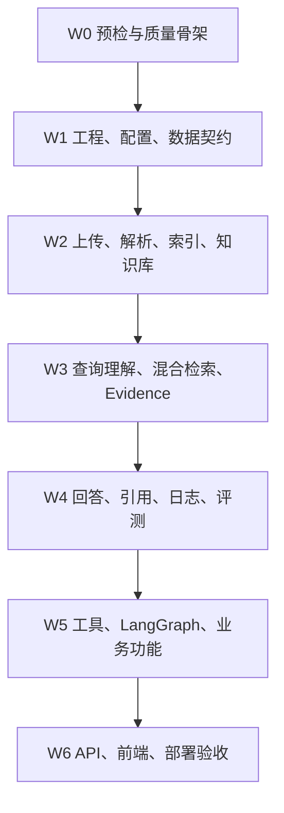

# 04 - Implementation Blueprint：Agentic RAG 国际公法研究助手

> 项目：**PublicLaw Research Agent**
> 文档用途：Codex 主 Agent 的开发启动指令、依赖顺序、分工协议与质量门禁
> 输入基线：`01-proposal.md`、`02-detailed_design.md`、`03-vibe-coding-task/`
> 默认回答：English，IRAC + Sources
> 执行模式：主 Agent 编排，子 Agent 按边界实现；全过程可恢复、可验证、可追踪
> 版本：2026-07-10

本文件不是新的需求文档。它负责把现有需求、详细设计和 24 个任务文件转换为可执行开发计划。启动开发时，应把本文件作为主入口，并继续以三个输入源作为功能与设计依据。

---

## A. 实施基线与审查结论

### A.1 最终目标与范围边界

交付一个面向国际公法案例 PDF 的 Agentic RAG 研究助手，完成以下闭环：

```text
PDF 上传 → 异步解析 / OCR → 法律结构化 Chunk → Citation Anchor
→ Elasticsearch BM25 + Milvus Dense Retrieval → RRF + Reranker
→ Query Classifier / Normalization / Rewrite → Evidence Pack
→ Answerability → 必要时可信联网补充
→ 英文 IRAC 生成 → Citation Verification → Evaluation & Logging
→ FastAPI API → Streamlit 演示 → Docker Compose 可复现部署
```

本版本明确不做：本地法律大模型训练、复杂权限系统、商业级法律数据库、默认开放全网搜索，以及把模型内部知识作为法律结论的最终依据。

核心可靠性原则：

- 任何关键法律结论必须来源于本次 `EvidencePack` 或可信联网证据。
- 默认输出英文 `Issue / Rule / Application / Conclusion / Sources`。
- 引用至少包含标题、引用页码和原句；可识别时必须包含段落号。
- 本地证据与可信联网证据均不足时，必须明确说明资料不足，不得补写确定性结论。
- Streamlit 只通过 HTTP/JSON 调用 FastAPI，不直接调用模型、数据库、解析器、Milvus、Elasticsearch 或 Firecrawl。

### A.2 文档优先级与冻结决策

发生不一致时按以下优先级处理：

1. `01-proposal.md`：产品目标、范围与最终验收标准。
2. `02-detailed_design.md`：技术选型、数据模型、API、状态机与失败恢复的实现依据。
3. `03-vibe-coding-task/*.md`：任务粒度、检查清单和进度追踪。
4. 本文件：依赖纠错、遗漏补齐、Agent 协议与质量门禁。

以下决策在首轮开发中冻结，子 Agent 不得自行替换：

| 决策项 | 实施选择 |
|---|---|
| 工作流 | LangGraph；不再保留 CrewAI Flow 二选一 |
| 数据库 | PostgreSQL + SQLAlchemy 2.0 + Alembic；MVP 使用统一同步 Session，避免同一业务链混用同步/异步数据库访问 |
| 向量检索 | BAAI/bge-m3 + Milvus；开发/演示使用 Standalone，单元测试使用 fake adapter |
| 关键词检索 | Elasticsearch BM25 |
| 重排 | BAAI/bge-reranker-v2-m3 |
| PDF | PyMuPDF 主解析，pypdf 辅助，Unstructured / PaddleOCR 作为受控 fallback |
| 异步任务 | MVP：FastAPI BackgroundTasks + PostgreSQL `background_tasks`；RQ/Celery 仅保留适配接口 |
| LLM | 统一 OpenAI-compatible Provider；Qwen/DeepSeek 通过配置切换，业务层不得直接调用 SDK |
| 联网 | Firecrawl client + trusted source whitelist；白名单为空时禁止退化为开放全网搜索 |
| 可观测性 | PostgreSQL 本地日志为必需；Langfuse 可配置、不可用时不阻断业务 |
| 包管理 | `pyproject.toml` + `uv.lock`；首次生成 lock，之后使用 frozen sync |
| Python | 仓库已声明版本时沿用；未声明时使用 Python 3.12，并在 `requires-python`、mypy、ruff、CI 中保持一致 |

### A.3 任务顺序检查

现有编号可以保留，但不能机械地按 `01 → 24` 串行执行。

| 发现 | 风险 | 蓝图修正 |
|---|---|---|
| `06 Knowledge Base Management` 依赖 `07 Indexing`，但编号在其之前 | reindex/delete 无实现可调用 | 实际执行 `05 → 07 → 06` |
| `16 Evaluation` 声明依赖 Logging，而 `17 Logging` 在后 | 评测日志接口未就绪 | 实际执行 `15 → 17 → 16` |
| 详细设计中 LangGraph 调用工具层，而 `19 Tools` 排在 `18 Workflow` 后 | Workflow 会绕过工具契约或重复封装 | 实际执行 `19 → 18` |
| `20/21` 在 progress 的 Phase 1 出现，但又依赖完整核心服务 | 早期只能做空壳，后续大量返工 | Phase 1 只建 API/UI 骨架；完整实现放在 Workflow 后 |
| `23 Testing & Quality` 排在全部功能之后 | 单元测试、类型错误和接口漂移积累到最后 | `23A` 在开工时配置；每个任务同步交付测试；`23B` 最终收口 |
| `24 Docker` 在末尾，但 PostgreSQL/ES/Milvus 集成测试早期就需要 | 集成环境无法复现 | `24A` 提前提供开发服务；`24B` 最终完成镜像、健康检查和文档 |
| `09/12/14` 依赖 LLM Provider，但没有对应任务 | 三个模块无统一调用层 | 新增强制补丁任务 `P-LLM` |
| 详细设计新增 Normalization、异步任务、Feedback，任务包未覆盖 | 工作流节点、API 和验收项缺失 | 新增 `P-NORM`、`P-TASK`、`P-FEEDBACK` |
| Task 03 未完整覆盖详细设计中的新增表 | 后续模块临时改库，迁移反复 | 在 `03` 中补齐全部表后再放行下游 |

### A.4 必须并入的补丁任务

补丁任务不另行改动 01–24 的编号；主 Agent 在 `progress.md` 中将其记录在相关模块的验收备注内。

#### P-LLM：LLM Provider 与 Prompt Registry

归属：完成 `02` 后、开始 `09/12/14/15` 前。

- 定义 `LLMProvider` Protocol/ABC，至少包含结构化生成、普通生成、超时、重试和 usage 返回。
- 实现 OpenAI-compatible provider；所有 provider 参数从 `models.yaml` 和 `.env` 读取。
- 实现 `PromptRegistry`，读取 `prompts.yaml`，记录 prompt name、version、hash。
- 提供 deterministic fake provider，供 Query Classifier、Answerability、Generator、Citation Verifier 单元测试使用。
- 禁止在 service、workflow node 或 API router 中直接实例化第三方 LLM client。

#### P-NORM：Case Alias & Legal Term Normalization

归属：`03` 后即可开发，必须在 `10 Query Rewrite` 与 `18 Workflow` 前完成。

- 实现案件标准名、别名、条约缩写、Article 编号和法律术语扩展。
- 使用 `case_aliases` 表及 `data/legal_terms/*.yaml`，输出结构化 `NormalizationResult`。
- 工作流顺序固定为：Classifier → Normalization → Rewrite → Retrieval。
- 至少覆盖 `Nicaragua case`、`VCLT Article 31`、中文“国家责任归因”三个测试。

#### P-TASK：后台任务、任务 API 与恢复

归属：数据库 `03` 后建立基础，在 `04/05/07/16` 中逐步接入。

- 实现 `TaskService`、状态机、进度、重试计数、取消和错误记录。
- parse、OCR、index、reindex、batch evaluation 必须返回 `task_id`，不得长时间阻塞 HTTP。
- 实现 `GET /tasks/{task_id}` 与 `POST /tasks/{task_id}/cancel`。
- 重启后可从 PostgreSQL 读取任务终态；MVP 不承诺恢复进程内正在执行的函数，但必须把中断任务标记为可重试失败。

#### P-FEEDBACK：用户反馈闭环

归属：`03` 建表，`20` 提供 API，`21` 展示入口。

- 实现 `feedback_logs`、Repository、Service、`POST /feedback` 与按 message 查询。
- rating 限制 1–5，反馈类型使用详细设计枚举。
- 反馈不得自动修改 prompt、索引或评测集，只作为后续分析数据。

#### P-CONTRACT：共享契约与安全边界

归属：`01–03`，由主 Agent 保留最终所有权。

- 补齐 `background_tasks`、`case_aliases`、`trusted_web_sources`、`web_evidence`、`prompt_versions`、`feedback_logs`。
- 统一 `ApiResponse`、分页协议、错误码、ID、时间、状态枚举和 trace 传递方式。
- 上传必须校验扩展名、MIME、PDF magic bytes、文件大小、hash、路径穿越。
- API key 只从 `.env` 获取；日志脱敏；前端错误不得返回后端 stack trace。

### A.5 统一字段与命名

为避免 Agent 在三个输入源之间自行选择，统一采用以下命名：

| 冲突项 | 统一实现 |
|---|---|
| 原始 PDF 路径 | `storage/raw_pdfs/{doc_id}.pdf`，不使用 `data/raw/` |
| 页码 | `pdf_page_number`、`printed_page_number`、`citation_page_number` 三字段 |
| 解析状态 | `not_started / pending / running / success / partial_success / failed` |
| 索引状态 | `not_indexed / indexing / indexed / partial_indexed / failed` |
| Evidence 来源 | `source_channel = local_pdf | trusted_web` |
| Firecrawl key | `FIRECRAWL_API_KEY`；修正任务文件中的 `FIREFCRAWL_API_KEY` 拼写 |
| 工作流 State | `PublicLawRAGState`；API 外部字段保持详细设计的请求/响应协议 |
| Citation | 以 `citation_anchor` 作为验证主键，展示时再格式化标题、页码、段落号和原句 |

### A.6 全局 Definition of Done

一个任务只有同时满足以下条件才可在 `progress.md` 勾选：

- 任务文件中的交付物、Checklist、独立测试全部完成。
- 新增/修改代码具有完整类型标注和 Pydantic/Protocol 契约。
- 正常路径、边界条件、失败路径至少各有一类测试。
- 相关单元测试通过；涉及跨模块调用时，相应集成测试通过。
- `ruff format --check`、`ruff check`、`mypy` 对变更范围通过。
- 没有硬编码密钥、绝对路径、模型名、阈值、可信域名或 prompt。
- 没有吞掉异常；用户可恢复错误、系统错误和降级结果可以区分。
- 文档、配置示例、迁移与代码保持同步。
- 主 Agent 复核 diff、测试输出和依赖边界后，亲自更新进度；子 Agent 不得自行宣告整体完成。

---

## B. 执行顺序、Agent 分工与验证策略

### B.1 Agent 组织模型

主 Agent 是唯一 Orchestrator。每个子 Agent 接收一个有边界的模块任务；可以复用同一角色，但每次任务都必须重新声明写入范围和验收命令。

| 角色 | 主要职责 | 禁止事项 |
|---|---|---|
| Main / Orchestrator | 读取全部输入、维护依赖图、冻结契约、分派任务、审查 diff、运行集成门禁、更新 progress | 不把未验证的子 Agent 结论直接视为完成 |
| Foundation Agent | 01–03、P-CONTRACT、P-LLM、P-TASK 基础 | 不替业务模块设计临时 schema |
| Ingestion Agent | 04、05、07、06 | 不在解析器中直接操作 API/router；不在索引库保存业务真源 |
| Retrieval Agent | P-NORM、08–13 | 不让 LLM 内部知识替代 evidence；不绕过 whitelist |
| Reasoning Agent | 14、15 | 不生成 Evidence Pack 外引用；证据不足必须保守回答 |
| Quality/Observability Agent | 17、16、23 | 不把外部服务不可用当作单元测试失败；不降低门禁来换取通过 |
| Workflow/Tool Agent | 19、18、22 | 不绕过 Tool/Service 契约；必须实现循环上限和失败分支 |
| API/UI/Delivery Agent | 20、21、24 | 不把业务逻辑放进 router 或 Streamlit |
| Reviewer Agent | 只读审查契约、测试遗漏、引用安全与回归风险 | 不与实现 Agent 同时修改同一文件 |

并发规则：

- 主 Agent 同时最多启动 3 个子 Agent；只有依赖已满足且写入范围无交集的任务才可并行。
- `schemas/`、`db/models.py`、Alembic migration、`config/`、`workflow/state.py`、`app/main.py` 属于共享热点文件，修改权由主 Agent 显式分配。
- 并行前先合入共享 Schema/Protocol，再开发实现，禁止多个 Agent 各自定义同名模型。
- 子 Agent 不修改 `progress.md`；只返回 handoff。主 Agent 验收后更新任务文件 checkbox 与总进度。
- 若仓库支持 git，优先为并行任务使用独立 branch/worktree；若不使用 worktree，则只允许互斥写入范围并在每轮前重新检查工作区。
- 绝不覆盖用户已有改动；发现重叠修改时停止该文件写入，保留现状并交由主 Agent 合并。

子 Agent handoff 必须包含：

```yaml
task_id: "07-indexing"
status: completed | partial | blocked
files_changed: []
contracts_added_or_changed: []
tests_added: []
commands_run: []
results: []
assumptions: []
known_risks: []
next_dependency_unlocked: []
```

### B.2 依赖波次与真实执行顺序



| 波次 | 执行内容 | 可并行项 | 退出门禁 / 里程碑 |
|---|---|---|---|
| W0 | 仓库预检；建立 `23A` ruff/mypy/pytest；建立 `24A` 开发依赖服务；记录基线 | 质量配置与开发 compose 可并行 | baseline 可重复；`/health` smoke test；冻结 Python/uv |
| W1 | `01 → 02 → 03`；同时补 `P-CONTRACT`；随后 `P-LLM`、`P-TASK` 基础、`17A` 本地 trace/error logging | `P-LLM` 与 `P-TASK/17A` 在 02/03 完成后并行 | 配置加载、全部表和 migration、Repository、fake LLM、任务状态测试通过 |
| W2 | `04 → 05 → 07 → 06` | 05 的纯文本处理算法可与 04 API adapter 后半段并行；07 必须等可用 chunk | M2：上传→异步解析→Citation Anchor→索引→检索前数据准备完整 |
| W3 | `08`；`P-NORM + 09` 可并行；再 `10 → 11` | 08 与 P-NORM/09 写入不重叠时并行 | M3：BM25 + Dense + RRF + Reranker 可形成受 token 控制的 Evidence Pack |
| W4 | `12` 与 `14` 可并行；随后 `13`、`15`；完成 `17B` Langfuse spans；再 `16` | 13 与 15 在各自依赖满足后并行 | IRAC 只引用 Evidence；虚构引用被拦截；本地日志必达；RAGAS 可降级 |
| W5 | `19 → 18 → 22` | 19 的独立 tool wrappers 可按工具拆分；18 由单一 Agent 集成 | M4：完整 LangGraph 分支、循环上限、checkpoint、业务模板通过 |
| W6 | `20 → 21`；`23B` 全量质量收口；`24B` 镜像与一键启动 | UI 与 Dockerfile 可在 API Contract 冻结后并行 | M5/M6：API、UI、评测/trace 展示、Docker Compose、README 全部可复现 |

说明：任务 ID 保持原文件编号，实际执行顺序以本表为准。`23` 和 `24` 是贯穿式任务，只有 W6 结束时才勾选整体完成。

### B.3 每波次的实施细则

#### W0：预检，不改业务逻辑

主 Agent 必须先完成：

1. 读取根目录 `AGENTS.md`、README、pyproject/requirements、git status、现有测试与原型入口。
2. 建立当前代码、测试、类型检查、lint 的基线报告；失败可以保留，但必须区分“既有失败”和“本次引入”。
3. 确认原型代码保留在 `legacy/` 或 `frontend/legacy/`，不得静默删除。
4. 若项目未使用 uv，则创建 `pyproject.toml` 和 lock；若已有包管理方案，不做无依据迁移。
5. 创建测试 markers、fake adapters 和最小测试 PDF 计划。

#### W1：先冻结契约，再允许并行

- `03` 不是只创建四张核心表，必须覆盖详细设计的完整表清单。
- Alembic migration 是数据库结构唯一变更入口；测试不得依赖运行时 `create_all()` 代替正式 migration，单元测试 fixture 除外。
- 配置按 `sources/models/retrieval/prompts/evaluation/database/security/app` 分类；敏感值只在 `.env`。
- 外部依赖全部定义 Protocol/adapter：LLM、Embedding、Milvus、Elasticsearch、Firecrawl、Langfuse。
- 建立 `ApiResponse`、分页、错误码、TraceContext、状态枚举后，再分派下游任务。

#### W2：数据真源与索引一致性

- PostgreSQL 是文档/chunk/citation 的真源；Milvus、Elasticsearch 可删除重建。
- 上传写文件和数据库必须具备补偿：任一步失败都不能留下不可识别的脏记录。
- PDF 解析按页保存原始/清洗文本、三类页码、来源类型和错误；OCR 单页失败允许 `partial_success`。
- Indexing 采用幂等 upsert；双索引只成功一侧时记录 `partial_indexed`，提供 reindex 修复。
- `06` 的 delete/reparse/reindex 使用 service 和 adapter，不在 Repository 中调用外部索引服务。

#### W3：检索证据闭环

- Query Rewrite 不得添加用户问题中不存在的事实限定。
- BM25 与 Dense 使用同一 metadata filter 语义；对分数方向做归一化并写测试。
- 某一路检索不可用时允许单路降级；两路都失败才返回 `RETRIEVAL_FAILED`。
- Reranker 不可用时回退到 fused ranking，并记录降级事件。
- Evidence Pack 去重、相邻 chunk 合并、官方来源优先、token budget 和 citation card 数据必须可独立测试。

#### W4：生成安全与评测

- Answerability 只能根据证据判断；空证据必须 `unanswerable`。
- Trusted Web Search 只搜索白名单；网页 evidence 明确标记 `trusted_web`，不覆盖本地 PDF 优先级。
- Generator 使用结构化 source block，并只接受其中的 `citation_anchor`。
- Citation Verification 依次执行存在性、元数据、原句/近似匹配、claim support；失败动作只能是 revise、retrieve_more 或 insufficient evidence。
- Evaluation 失败不得影响已通过引用校验的最终答案；自定义 citation 指标仍需运行。

#### W5：编排与业务功能

- Tool wrapper 只做 schema 校验、调用 service、统一错误；不复制业务逻辑。
- LangGraph 必须包含 normalize_query 节点、可信联网条件边、citation revise/retrieve_more 分支、最大重试/循环次数和不足证据终态。
- 每个节点输入输出均由 `PublicLawRAGState` 明确承载；禁止把隐式全局变量作为节点间状态。
- Case Brief、Concept Explanation、Case Comparison 共享 Retrieval、Evidence、Citation Verification，不建立旁路链路。

#### W6：接口与交付

- Router 只负责参数、鉴权/限流钩子、service 调用和 response mapping。
- 长任务 API 返回 `task_id`；问答 API 返回 `message_id`、`trace_id`、answer、sources、answerability、fallback、citation verification 和 metrics。
- Streamlit 使用单独 API client；核心 service 不得被 frontend import。
- Docker Compose 的必需服务为 api、frontend、postgres、elasticsearch、milvus/etcd/minio；redis、langfuse 可用 profile/可选配置。
- 关闭外部 API key 时系统仍能启动，相关端点返回清晰配置错误；`/health` 不因可选服务缺失失败。

### B.4 测试金字塔与责任

测试不是 `23` 的末尾补作业，而是每个子 Agent 的交付物。

| 层级 | 范围 | 外部依赖策略 | 执行时机 |
|---|---|---|---|
| Unit | schema、规则、service、repository、workflow node、metric | fake/mock；禁止真实 API 和网络 | 每个 task handoff 前 |
| Contract | adapter 输入输出、错误映射、Pydantic 校验 | deterministic fake server/client | adapter 或 Tool 修改时 |
| Integration | PostgreSQL migration/CRUD、ES/Milvus indexing、FastAPI routes、跨 service 链路 | Docker Compose 测试服务 | 每波次结束 |
| Workflow | answerable、partial/unanswerable、web failure、citation partial/failed、最大循环 | fake LLM/search/retrieval | W4/W5 持续 |
| E2E | 上传→解析→索引→问答→引用→评测→UI/API 摘要 | 固定测试 PDF；LLM 可使用录制响应 | W6 与发布前 |
| External smoke | 真实 LLM/Firecrawl/Langfuse 可用性 | 显式 opt-in，需 key | 不进入默认 CI 阻塞门禁 |

最低测试集合：

- 每种 `query_type` 至少 1 个样例。
- PDF：文本型、有段落号、无段落号、空页/OCR mock、乱码、解析失败。
- Retrieval：BM25 only、Dense only、双路融合、过滤、去重、reranker 降级。
- Answerability：空、高相关、低相关、来源不匹配。
- Citation：虚构 anchor、错页码、错段落号、原句不匹配、unsupported claim、完全通过。
- Workflow：本地可回答、本地不足+联网成功、联网失败、citation revise、retrieve_more、达到循环上限。
- Index consistency：两侧成功、Milvus 失败、ES 失败、reindex 恢复、delete 幂等。
- API：统一成功/错误响应、404/409/413/429/500/502、trace_id、后台任务状态。

覆盖率门禁：

- `app/` 总行覆盖率不得低于 85%，分支覆盖率不得低于 80%。
- parsing、retrieval、citation verification、workflow 四个关键包行覆盖率目标不低于 90%。
- migration、第三方生成代码和 `legacy/` 可排除；不得通过扩大排除范围规避门禁。
- 修复 bug 时必须先添加能复现问题的回归测试。

建议 markers：

```ini
unit
integration
e2e
external
slow
ocr
```

### B.5 mypy 要求

`mypy` 是强制门禁，不使用“mypy 或 pyright 二选一”。建议配置：

```toml
[tool.mypy]
python_version = "3.12"
strict = true
warn_unused_configs = true
warn_unreachable = true
show_error_codes = true
pretty = true
exclude = ["migrations/", "legacy/", "frontend/legacy/"]
```

执行与约束：

- 默认命令：`uv run mypy app scripts`。
- 所有 public function、method、Protocol、Pydantic model 和 workflow state 必须完整标注。
- 禁止全局 `ignore_missing_imports = true`；仅可对确实无类型声明的第三方包做精确 per-module override，并写明原因。
- 禁止无说明的 `# type: ignore`；必须带错误码，例如 `# type: ignore[import-untyped]`。
- 优先用 Protocol、TypedDict、泛型 Repository 和显式 DTO，避免用 `Any` 穿透 service 边界。
- 测试代码可不启用 strict，但 fixtures 与 fake adapter 的接口必须与生产 Protocol 一致。
- Python 版本不是 3.12 时，必须同步修改 `requires-python`、uv、mypy、ruff 和 CI，不能只改其中一处。

### B.6 ruff 要求

建议配置：

```toml
[tool.ruff]
target-version = "py312"
line-length = 100
extend-exclude = ["migrations", "legacy", "frontend/legacy"]

[tool.ruff.lint]
select = ["E", "F", "I", "UP", "B", "ASYNC", "C4", "DTZ", "PIE", "PT", "RET", "RUF", "S", "SIM"]

[tool.ruff.lint.per-file-ignores]
"tests/**/*.py" = ["S101"]
```

强制命令：

```bash
uv run ruff format --check .
uv run ruff check .
```

格式修复只能使用 `uv run ruff format .`；自动修复 lint 前必须先检查 diff，禁止对用户已有代码做无关的大范围机械改写。

### B.7 每任务与每波次质量门禁

每个子 Agent handoff 前：

```bash
uv run pytest -q <本模块测试路径>
uv run ruff format --check <变更路径>
uv run ruff check <变更路径>
uv run mypy <变更模块路径>
```

每个波次结束由主 Agent 执行：

```bash
uv sync --frozen
uv run ruff format --check .
uv run ruff check .
uv run mypy app scripts
uv run pytest -q -m "not integration and not e2e and not external"
```

涉及数据库/索引/API 的波次追加：

```bash
docker compose config
uv run pytest -q -m integration
```

最终发布门禁：

```bash
uv sync --frozen
uv run ruff format --check .
uv run ruff check .
uv run mypy app scripts
uv run pytest --cov=app --cov-branch --cov-report=term-missing --cov-fail-under=85
docker compose config
docker compose up -d --build
uv run pytest -q -m e2e
```

如命令与当前仓库的既有脚本不同，主 Agent可以使用等价命令，但必须在 handoff/质量报告中记录映射，不能跳过检查。

### B.8 失败恢复、阻塞与进度协议

- 可局部修复的失败：子 Agent 最多自修复 2 次；仍失败则返回最小复现、日志、已尝试方案和建议 owner。
- 外部服务不可用：使用 adapter/fake 完成本地实现与测试；在集成报告标记 blocked，不得伪造成功。
- 信息不明确但不改变架构：采用最保守、最可逆的默认值，并写入 `docs/assumptions.md`。
- 只有以下情况暂停并请求用户：缺少不可替代的文件/密钥、两个权威输入存在会改变产品范围的冲突、需要破坏性迁移或删除用户数据、必须选择无法回滚的外部服务方案。
- 任何失败不得通过删除测试、降低覆盖率、扩大 ignore/exclude、关闭 type check 或绕过 Citation Verification 解决。

建议由主 Agent 维护：

```text
03-vibe-coding-task/progress.md     # 用户可见模块进度，验收后更新
docs/decisions.md                   # 架构决策与变更原因
docs/assumptions.md                 # 无人值守期间的可逆假设
reports/quality/latest.md           # 最近一次完整质量门禁结果
reports/integration/latest.md       # 服务集成与阻塞项
```

---

## C. 可直接启动开发的主 Agent 指令

将下面整段交给 Codex，或直接要求 Codex 读取本文件并执行。

```text
你是 PublicLaw Research Agent 项目的 Main / Orchestrator Agent。

目标：基于现有原型，把项目实现为可追溯、可验证、可评估的 Agentic RAG 国际公法研究助手。开发过程不需要用户持续参与；你负责读取文档、规划依赖、创建子 Agent、集成代码、测试、修复、记录决策并持续推进，直到所有里程碑完成或出现本文件定义的硬阻塞。

权威输入：
1. 01-proposal.md
2. 02-detailed_design.md
3. 03-vibe-coding-task/README.md
4. 03-vibe-coding-task/progress.md
5. 03-vibe-coding-task/01-project-infrastructure.md 至 24-docker-deployment.md
6. 04-implementation-blueprint.md

开始时必须：
1. 阅读全部输入和仓库级 AGENTS.md/README/配置；检查 git status，保护用户已有改动。
2. 按 04-implementation-blueprint.md 的文档优先级、冻结决策、统一字段和补丁任务执行。
3. 不机械执行 01→24；使用 W0→W6 的依赖波次。关键纠错为 05→07→06、15→17→16、19→18；23/24 分成早期骨架和最终收口。
4. 先建立 ruff、mypy、pytest 和 uv lock 基线，再开发功能。
5. 先冻结共享 Schema、Protocol、数据库迁移和错误协议，再并行分派子 Agent。

Agent 规则：
- 每次只给子 Agent 一个边界明确的模块任务，写清依赖、允许修改路径、禁止修改路径、验收测试和 handoff 模板。
- 同时最多运行 3 个子 Agent；只有依赖完成、写入范围互斥时才能并行。
- 子 Agent 不更新 progress.md；你审查 diff 并重跑门禁后再更新。
- 共享热点文件由你分配唯一 owner；禁止多个 Agent 重复定义 Schema 或修改同一 migration。
- 子 Agent 的完成声明不是验收证据；测试输出、类型检查、lint、契约和 diff 审查才是。

实现约束：
- Streamlit 仅调用 FastAPI；核心业务逻辑必须位于 service/tool/workflow。
- PostgreSQL 是业务真源；Milvus 与 Elasticsearch 只保存可重建索引。
- 所有外部系统通过 Protocol/adapter；单元测试使用 deterministic fake/mock。
- LLM 只能通过统一 OpenAI-compatible Provider；prompt 必须可配置、可版本化。
- 所有答案只可引用本次 Evidence Pack 或 trusted_web evidence；Citation Verifier 失败必须 revise、retrieve_more 或返回 insufficient evidence。
- 本地与联网证据都不足时明确说明不足，不得使用模型内部知识补写法律依据。
- 长任务使用 BackgroundTasks + background_tasks 表，返回 task_id 并记录状态、进度、错误和重试。

质量门禁：
- 每个任务同时交付生产代码、单元测试、失败路径测试和必要文档。
- 必须通过 ruff format --check、ruff check、mypy、相关 pytest；每波次结束运行完整非 external 测试。
- app 总行覆盖率 ≥85%、分支覆盖率 ≥80%；解析、检索、引用校验、工作流关键包目标 ≥90%。
- 禁止用删除测试、降低阈值、扩大 ignore/exclude、关闭检查或硬编码来获得通过。

进度与恢复：
- 维护 progress.md、docs/decisions.md、docs/assumptions.md、reports/quality/latest.md。
- 可逆的小歧义由你采用保守默认值并记录；只有缺失不可替代输入、破坏性操作、范围级冲突或不可回滚外部决策才暂停提问。
- 任何失败都要保留最小复现、尝试记录和下一步；外部服务不可用时先完成 adapter 与 fake 测试，不得伪造集成成功。

现在从 W0 开始。先输出简短的仓库基线、依赖图、首批子 Agent 任务及其写入边界，然后立即执行，不等待普通确认。
```

### C.1 最终验收清单

开发结束前，主 Agent 必须证明：

- [ ] 24 个原任务及 P-LLM、P-NORM、P-TASK、P-FEEDBACK、P-CONTRACT 均有可追溯验收证据。
- [ ] PDF 上传、解析/OCR、chunk、三类页码、citation anchor、异步状态闭环可用。
- [ ] PostgreSQL、Milvus、Elasticsearch 一致性、降级、reindex 和幂等删除通过测试。
- [ ] Query Classifier、Normalization、Rewrite、Hybrid Retrieval、Evidence Pack 可用。
- [ ] Answerability 与可信联网分支可用，白名单为空时不会开放全网搜索。
- [ ] 英文 IRAC、Case Brief、Concept Explanation、Case Comparison 均包含可验证 Sources。
- [ ] 虚构引用、错误页码/段落号和 unsupported claim 能被拦截。
- [ ] LangGraph 的正常、fallback、revise、retrieve_more、失败终态和循环上限均通过测试。
- [ ] FastAPI、Streamlit、后台任务 API、反馈 API 和统一错误协议可用。
- [ ] PostgreSQL 日志和 trace_id 必达；Langfuse、RAGAS 不可用时可降级。
- [ ] ruff、mypy、pytest、覆盖率、Docker Compose config、E2E 全部达到门禁。
- [ ] `.env.example`、README、启动命令、migration、索引初始化和演示流程可由新环境复现。

完成条件不是“代码能运行一次”，而是：输入契约稳定、失败可恢复、证据可追溯、质量门禁可重复、文档可复现。
